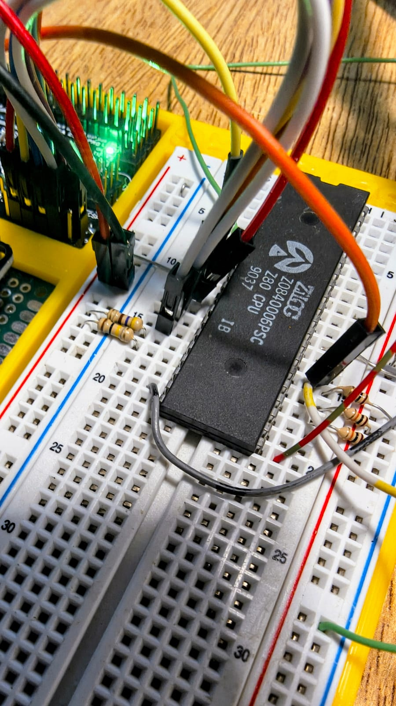
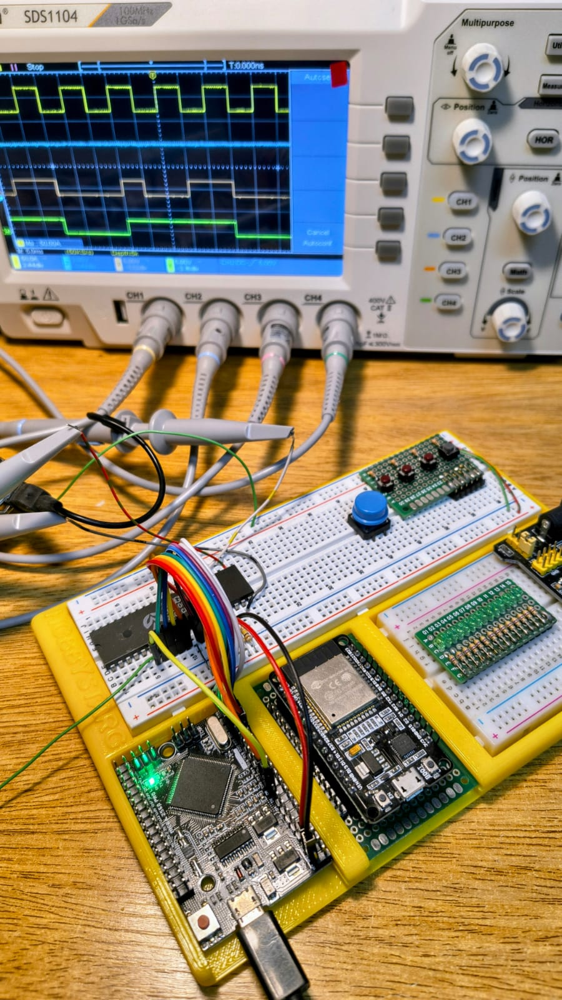

# Z80 Minimal Computer - Etapa 001

## Clock, Reset y ejecución de NOPs con Arduino Mega


## Objetivo de esta etapa

El objetivo de esta primera etapa es comprobar que un microprocesador **Zilog Z80** puede ser alimentado, recibir una señal de clock externa, salir de reset y comenzar a ejecutar ciclos de lectura de instrucciones.

Todavía no se conecta RAM, ROM ni ningún periférico real. En su lugar, se usa un **Arduino Mega 2560** como sistema auxiliar para:

* generar una señal de clock lenta y controlada;
* controlar la línea `/RESET` del Z80;
* colocar el valor `00h` en el bus de datos del Z80;
* permitir observar el comportamiento de la CPU con osciloscopio.

El valor `00h` corresponde a la instrucción `NOP` en el Z80. Por lo tanto, al mantener el bus de datos en `00000000`, el procesador lee y ejecuta instrucciones `NOP` continuamente. Esto permite verificar que la CPU avanza por memoria, aunque todavía no exista una memoria física conectada.

Esta etapa no busca ejecutar un programa útil, sino comprobar que la CPU está viva y que las señales básicas funcionan correctamente.

<p align="center">
  
  
</p>

---

## Componentes utilizados

* 1 × CPU **Zilog Z0840006PSC Z80 CPU**, encapsulado DIP-40.
* 1 × **Arduino Mega 2560 Pro Embed** o compatible.
* 1 × protoboard o placa de pruebas.
* Cables Dupont.
* Resistencias de 10 kΩ para pull-up.
* 1 × capacitor cerámico de 100 nF para desacople entre VCC y GND del Z80.
* Osciloscopio de 4 canales, usado para verificar señales.
* Fuente de 5 V tomada desde el Arduino Mega, solamente para esta prueba inicial.

---

## CPU utilizada

La CPU utilizada en esta prueba es:

```text
Zilog Z0840006PSC
Z80 CPU
DIP-40
Código de fecha: 9037
```

El código `9037` probablemente indica año y semana de fabricación: semana 37 de 1990.

Para esta etapa se trabaja con frecuencias muy bajas, por ejemplo 100 Hz, 1 kHz o similares. Esto está muy por debajo de la frecuencia máxima del chip, pero resulta ideal para depuración y observación con osciloscopio.

---

## Idea general del circuito

El Arduino Mega actúa como una especie de “panel de control” o supervisor externo.

```text
Arduino Mega
│
├── genera CLOCK para el Z80
├── controla /RESET
├── pone D0-D7 en LOW para entregar 00h = NOP
└── permite cambiar la frecuencia desde el Serial Monitor

Z80
│
├── recibe CLOCK
├── recibe /RESET
├── lee 00h desde el bus de datos
└── ejecuta NOPs continuamente
```

No hay memoria conectada en esta etapa. El bus de datos es manejado por el Arduino Mega, que mantiene sus ocho líneas en bajo.

---

## Conexiones principales

### Alimentación

| Z80 pin | Señal Z80 | Conectar a         | Descripción          |
| ------: | --------- | ------------------ | -------------------- |
|      11 | VCC       | Arduino Mega `5V`  | Alimentación de +5 V |
|      29 | GND       | Arduino Mega `GND` | Masa común           |

Se recomienda colocar un capacitor cerámico de 100 nF lo más cerca posible del Z80:

```text
Z80 pin 11 / VCC ── 100 nF ── Z80 pin 29 / GND
```

---

## Clock y reset

Se usan dos pines del Arduino Mega que fueron verificados previamente con osciloscopio:

| Función | Arduino Mega | Puerto ATmega2560 | Z80 pin | Señal Z80 |
| ------- | -----------: | ----------------- | ------: | --------- |
| Clock   |           D8 | PH5               |       6 | CLK       |
| Reset   |          D10 | PB4               |      26 | `/RESET`  |

Conexión:

```text
Arduino D8  / PH5 ───── Z80 pin 6  / CLK
Arduino D10 / PB4 ───── Z80 pin 26 / RESET
```

La señal `/RESET` del Z80 es activa en bajo:

```text
/RESET = LOW   → CPU reseteada
/RESET = HIGH  → CPU liberada
```

Es recomendable agregar una resistencia pull-down de 10 kΩ entre `/RESET` y GND para mantener el Z80 reseteado mientras el Arduino está arrancando o siendo reprogramado:

```text
Z80 pin 26 /RESET ── 10 kΩ ── GND
```

---

## Entradas del Z80 con pull-up

Algunas entradas del Z80 son activas en bajo. Para evitar que queden flotando y generen comportamientos inesperados, se conectan a +5 V mediante resistencias de 10 kΩ.

| Z80 pin | Señal     | Conexión     | Motivo                                             |
| ------: | --------- | ------------ | -------------------------------------------------- |
|      16 | `/INT`    | 10 kΩ a +5 V | Evita interrupciones enmascarables accidentales    |
|      17 | `/NMI`    | 10 kΩ a +5 V | Evita interrupciones no enmascarables accidentales |
|      24 | `/WAIT`   | 10 kΩ a +5 V | Evita que la CPU quede detenida esperando          |
|      25 | `/BUSREQ` | 10 kΩ a +5 V | Evita que la CPU ceda el bus accidentalmente       |

Representación:

```text
Z80 pin 16 /INT     ── 10 kΩ ── +5V
Z80 pin 17 /NMI     ── 10 kΩ ── +5V
Z80 pin 24 /WAIT    ── 10 kΩ ── +5V
Z80 pin 25 /BUSREQ  ── 10 kΩ ── +5V
```

---

## Bus de datos

Para esta etapa no se usa ROM ni RAM. El Arduino Mega mantiene las líneas de datos del Z80 en bajo, entregando el byte:

```text
00000000b = 00h = NOP
```

Esto permite que el Z80 ejecute instrucciones `NOP` indefinidamente.

Se usa el puerto A completo del Arduino Mega:

| Señal Z80 | Z80 pin | Arduino Mega | Puerto ATmega2560 |
| --------- | ------: | -----------: | ----------------- |
| D0        |      14 |          D22 | PA0               |
| D1        |      15 |          D23 | PA1               |
| D2        |      12 |          D24 | PA2               |
| D3        |       8 |          D25 | PA3               |
| D4        |       7 |          D26 | PA4               |
| D5        |       9 |          D27 | PA5               |
| D6        |      10 |          D28 | PA6               |
| D7        |      13 |          D29 | PA7               |

Conexión completa:

```text
Z80 pin 14 / D0 ───── Arduino D22 / PA0
Z80 pin 15 / D1 ───── Arduino D23 / PA1
Z80 pin 12 / D2 ───── Arduino D24 / PA2
Z80 pin  8 / D3 ───── Arduino D25 / PA3
Z80 pin  7 / D4 ───── Arduino D26 / PA4
Z80 pin  9 / D5 ───── Arduino D27 / PA5
Z80 pin 10 / D6 ───── Arduino D28 / PA6
Z80 pin 13 / D7 ───── Arduino D29 / PA7
```

En el código, esto se configura con:

```cpp
DDRA = 0xFF;
PORTA = 0x00;
```

`DDRA = 0xFF` configura PA0-PA7 como salidas.

`PORTA = 0x00` pone todas esas salidas en bajo.

---

## Pines del Z80 no conectados en esta etapa

Las siguientes señales no se conectan a otros componentes en esta etapa. Algunas pueden medirse con el osciloscopio.

| Z80 pin | Señal     | Estado                                |
| ------: | --------- | ------------------------------------- |
|      18 | `/HALT`   | Sin conectar / medir opcional         |
|      19 | `/MREQ`   | Sin conectar / medir con osciloscopio |
|      20 | `/IORQ`   | Sin conectar                          |
|      21 | `/RD`     | Sin conectar / medir con osciloscopio |
|      22 | `/WR`     | Sin conectar                          |
|      23 | `/BUSACK` | Sin conectar                          |
|      27 | `/M1`     | Sin conectar / medir opcional         |
|      28 | `/RFSH`   | Sin conectar / medir opcional         |

El bus de direcciones también queda sin conectar, aunque se puede observar con el osciloscopio.

---

## Código Arduino

```cpp
/*
  Z80 Clock + Reset + NOP bus
  Arduino Mega 2560

  D8  / PH5 -> CLOCK hacia Z80 pin 6
  D10 / PB4 -> /RESET hacia Z80 pin 26

  D22-D29 / PA0-PA7 -> bus de datos Z80 D0-D7
  Todos en LOW para entregar 00h = NOP.
*/

const int Z80_CLK   = 8;   // D8  / PH5
const int Z80_RESET = 10;  // D10 / PB4

bool clkState = LOW;
unsigned long lastClockToggle = 0;

// Frecuencia inicial: 100 Hz
unsigned long halfPeriodMicros = 5000;

void setup() {
  // Clock y reset
  pinMode(Z80_CLK, OUTPUT);
  pinMode(Z80_RESET, OUTPUT);

  digitalWrite(Z80_CLK, LOW);

  // Mantener el Z80 reseteado mientras preparamos el bus
  digitalWrite(Z80_RESET, LOW);

  // Puerto A completo como salida:
  // Arduino Mega D22-D29 = PA0-PA7
  DDRA = 0xFF;    // PA0-PA7 como salidas
  PORTA = 0x00;   // D0-D7 en LOW -> byte 00h -> NOP

  Serial.begin(115200);

  Serial.println();
  Serial.println("Z80 Clock + Reset + NOP bus");
  Serial.println("--------------------------------");
  Serial.println("D8  / PH5 -> CLOCK");
  Serial.println("D10 / PB4 -> /RESET");
  Serial.println("D22-D29 / PA0-PA7 -> Z80 D0-D7 = 00h");
  Serial.println();

  Serial.println("Manteniendo /RESET en LOW durante 2 segundos...");
  delay(2000);

  digitalWrite(Z80_RESET, HIGH);

  Serial.println("/RESET liberado");
  Serial.println();
  Serial.println("Comandos:");
  Serial.println("1 = clock 1 Hz");
  Serial.println("2 = clock 10 Hz");
  Serial.println("3 = clock 100 Hz");
  Serial.println("4 = clock 1 kHz");
  Serial.println("r = pulso de reset");
}

void loop() {
  generarClock();
  leerComandos();
}

void generarClock() {
  unsigned long now = micros();

  if (now - lastClockToggle >= halfPeriodMicros) {
    lastClockToggle = now;

    clkState = !clkState;
    digitalWrite(Z80_CLK, clkState);
  }
}

void leerComandos() {
  if (!Serial.available()) {
    return;
  }

  char c = Serial.read();

  if (c == '1') {
    halfPeriodMicros = 500000;
    Serial.println("Clock: 1 Hz");
  }

  if (c == '2') {
    halfPeriodMicros = 50000;
    Serial.println("Clock: 10 Hz");
  }

  if (c == '3') {
    halfPeriodMicros = 5000;
    Serial.println("Clock: 100 Hz");
  }

  if (c == '4') {
    halfPeriodMicros = 500;
    Serial.println("Clock: 1 kHz");
  }

  if (c == 'r' || c == 'R') {
    Serial.println("Pulso de reset...");

    digitalWrite(Z80_RESET, LOW);
    delay(100);
    digitalWrite(Z80_RESET, HIGH);

    Serial.println("/RESET liberado");
  }
}
```

---

## Funciones del código

### `setup()`

Inicializa el sistema.

Sus tareas principales son:

* configurar el pin de clock como salida;
* configurar el pin de reset como salida;
* mantener el Z80 en reset al arrancar;
* configurar el puerto A completo del Arduino Mega como salida;
* poner el bus de datos en `00h`;
* inicializar el Serial Monitor;
* esperar 2 segundos;
* liberar el reset del Z80.

Esta espera inicial permite que las señales estén estables antes de permitir que el Z80 comience a ejecutar.

---

### `loop()`

Ejecuta continuamente dos tareas:

```cpp
generarClock();
leerComandos();
```

La función `generarClock()` mantiene la señal de clock.

La función `leerComandos()` revisa si el usuario escribió algún comando por el Serial Monitor.

---

### `generarClock()`

Genera una onda cuadrada en el pin D8 / PH5.

No usa `delay()`, sino que utiliza `micros()` para alternar el estado del pin cuando transcurre el semiperiodo configurado.

Ejemplo:

```cpp
if (now - lastClockToggle >= halfPeriodMicros) {
  lastClockToggle = now;
  clkState = !clkState;
  digitalWrite(Z80_CLK, clkState);
}
```

Si `halfPeriodMicros` vale `5000`, el pin cambia de estado cada 5000 microsegundos.

Eso produce:

```text
5000 us en HIGH + 5000 us en LOW = 10000 us
10000 us = 10 ms
10 ms = 100 Hz
```

---

### `leerComandos()`

Permite cambiar la velocidad del clock y generar un pulso de reset desde el Serial Monitor.

Comandos disponibles:

| Comando   | Acción          |
| --------- | --------------- |
| `1`       | Clock de 1 Hz   |
| `2`       | Clock de 10 Hz  |
| `3`       | Clock de 100 Hz |
| `4`       | Clock de 1 kHz  |
| `r` o `R` | Pulso de reset  |

Ejemplo de reset:

```cpp
digitalWrite(Z80_RESET, LOW);
delay(100);
digitalWrite(Z80_RESET, HIGH);
```

Esto mantiene `/RESET` en bajo durante 100 ms y luego libera nuevamente la CPU.

---

## Verificación con osciloscopio

Para esta etapa se usó un osciloscopio de 4 canales.

Conexión sugerida:

| Canal | Señal      | Pin                 |
| ----- | ---------- | ------------------- |
| CH1   | CLK        | Z80 pin 6           |
| CH2   | `/RESET`   | Z80 pin 26          |
| CH3   | `/MREQ`    | Z80 pin 19          |
| CH4   | `/RD` o A0 | Z80 pin 21 o pin 30 |

Primero se verificaron los pines del Arduino:

| Arduino Mega | Resultado      |
| ------------ | -------------- |
| D8 / PH5     | Señal correcta |
| D10 / PB4    | Señal correcta |

Luego se usaron esos pines para alimentar el clock y reset del Z80.

Resultado esperado:

* `CLK` debe mostrar una onda cuadrada.
* `/RESET` debe iniciar en bajo y luego pasar a alto.
* Al enviar el comando `r`, `/RESET` debe bajar brevemente y luego volver a alto.
* `/MREQ` y `/RD` deben mostrar actividad cuando la CPU intenta leer instrucciones.
* Si se observa A0, debería cambiar de estado mientras el Z80 avanza ejecutando NOPs.

---

## Por qué se usa `NOP`

En Z80, la instrucción `NOP` tiene opcode:

```text
00h
```

Al mantener todas las líneas de datos en bajo, el procesador lee siempre `00h`.

Esto permite probar la CPU sin ROM ni RAM. El Z80 interpreta cada lectura de memoria como una instrucción `NOP` y avanza a la siguiente dirección.

Este método es útil para comprobar:

* que el clock llega correctamente;
* que el reset funciona;
* que el Z80 intenta leer instrucciones;
* que el bus de direcciones cambia;
* que las señales `/MREQ`, `/RD`, `/M1` y `/RFSH` tienen actividad.

---

## Consideraciones importantes

### No conectar memoria todavía

En esta etapa, el Arduino Mega maneja directamente el bus de datos del Z80. Por eso no debe conectarse todavía una ROM, RAM u otro dispositivo que también intente manejar `D0-D7`.

Más adelante, cuando se conecte memoria real, el Arduino deberá dejar de manejar el bus de datos o hacerlo mediante buffers triestado.

---

### Mantener el Z80 en reset durante la carga del sketch

Durante la reprogramación del Arduino Mega, sus pines pueden quedar momentáneamente como entradas. Para evitar comportamiento indefinido en el Z80, conviene mantener la CPU en reset.

La resistencia pull-down de 10 kΩ en `/RESET` ayuda a que el Z80 permanezca reseteado mientras el Arduino arranca o se reprograma.

---

### Alimentación desde Arduino Mega

Para esta prueba inicial, el Z80 se alimenta desde el pin `5V` del Arduino Mega.

Esto es aceptable porque solamente se alimenta:

* la CPU Z80;
* algunas resistencias pull-up;
* el circuito mínimo de prueba.

Cuando se agreguen RAM, lógica 74HC/74HCT, buffers, LEDs, periféricos u otros componentes, convendrá usar una fuente externa regulada de 5 V y compartir masa con el Arduino.

---

## Estado actual

Estado de esta etapa:

```text
[OK] Arduino Mega genera clock por D8 / PH5.
[OK] Arduino Mega genera reset por D10 / PB4.
[OK] Señales verificadas con osciloscopio.
[OK] Bus de datos conectado entre Z80 y Arduino Mega.
[OK] Arduino Mega entrega 00h en D0-D7.
[OK] Z80 ejecuta NOPs para prueba básica de actividad.
```

---

## Próximos pasos

Los próximos pasos naturales son:

1. Medir `/MREQ`, `/RD`, `/M1` y `/RFSH` con el osciloscopio.
2. Medir A0, A1 y otras líneas del bus de direcciones.
3. Confirmar que el contador de programa avanza ejecutando NOPs.
4. Agregar visualización simple del bus de direcciones.
5. Diseñar la conexión de una SRAM.
6. Hacer que el Arduino cargue un programa en RAM antes de liberar el Z80.
7. Reemplazar la ejecución de NOPs por un programa real.
8. Implementar una salida simple mediante puerto de I/O.

