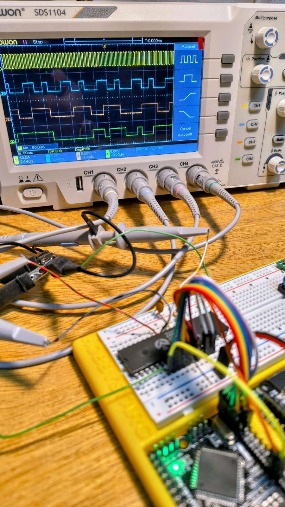
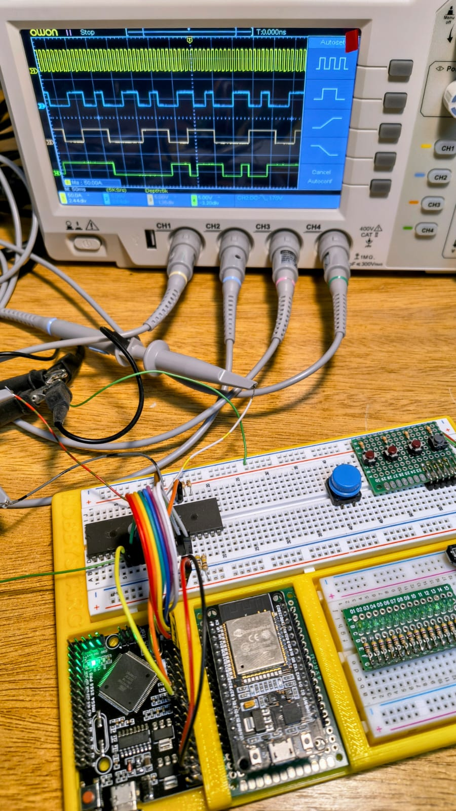

# Z80 Minimal Computer - Etapa 003

## Arduino Mega como ROM mínima y ejecución de `JP 0000h`


## Objetivo de esta etapa

El objetivo de esta etapa es comprobar que el microprocesador **Zilog Z80** puede leer una pequeña secuencia de instrucciones entregada por el **Arduino Mega 2560**, interpretarla correctamente y modificar el flujo de ejecución.

En las primeras pruebas, el Arduino Mega colocaba siempre `00h` en el bus de datos, lo que hacía que el Z80 leyera y ejecutara instrucciones `NOP` de forma continua. Luego se verificó que el procesador también podía ejecutar una instrucción distinta, como `76h = HALT`.

En esta etapa se da un paso más: el Arduino Mega deja de entregar un byte fijo y pasa a funcionar como una **ROM mínima de 8 bytes**. Para hacerlo, lee las líneas bajas del bus de direcciones del Z80 (`A0`, `A1` y `A2`) y entrega en el bus de datos un byte distinto según la dirección solicitada.

El programa emulado es:

```asm
0000h: C3 00 00    JP 0000h
```

Esto permite comprobar que el Z80:

* recibe correctamente la señal de clock;
* sale de reset;
* coloca direcciones en el bus de direcciones;
* lee distintos bytes desde el bus de datos;
* interpreta una instrucción de tres bytes;
* ejecuta un salto absoluto;
* vuelve a la dirección `0000h`.

Esta etapa todavía no utiliza RAM, ROM física ni periféricos reales. El Arduino Mega sigue actuando como sistema auxiliar de prueba.

<p align="center">
  
</p>

---

## Componentes utilizados

* 1 × CPU **Zilog Z0840006PSC Z80 CPU**, encapsulado DIP-40.
* 1 × **Arduino Mega 2560 Pro Embed** o compatible.
* 1 × protoboard o placa de pruebas.
* Cables Dupont.
* Resistencias de 10 kΩ para pull-up.
* 1 × resistencia de 10 kΩ para pull-down en `/RESET`.
* 1 × capacitor cerámico de 100 nF para desacople entre VCC y GND del Z80.
* Osciloscopio de 4 canales, usado para verificar señales.
* Fuente de 5 V tomada desde el Arduino Mega, solamente para esta prueba inicial.

---

## CPU utilizada

La CPU utilizada en esta prueba es:

```text
Zilog Z0840006PSC
Z80 CPU
DIP-40
Código de fecha: 9037
```

El código `9037` probablemente indica año y semana de fabricación: semana 37 de 1990.

Para esta etapa se trabaja con frecuencias muy bajas, por ejemplo 10 Hz, 100 Hz o 1 kHz. Esto está muy por debajo de la frecuencia máxima del chip, pero resulta ideal para depuración y observación con osciloscopio.

---

## Idea general del circuito

El Arduino Mega actúa como una especie de “panel de control” y como una ROM mínima.

```text
Arduino Mega
│
├── genera CLOCK para el Z80
├── controla /RESET
├── lee A0, A1 y A2 del Z80
├── entrega un byte en D0-D7 según la dirección baja
└── permite cambiar la frecuencia desde el Serial Monitor

Z80
│
├── recibe CLOCK
├── recibe /RESET
├── coloca direcciones en el bus de direcciones
├── lee bytes desde el bus de datos
└── ejecuta JP 0000h continuamente
```

No hay memoria conectada en esta etapa. El bus de datos es manejado por el Arduino Mega, que entrega los bytes definidos en un pequeño arreglo del programa.

---

## Programa emulado

El Arduino Mega emula una ROM mínima de 8 bytes usando las líneas `A0`, `A1` y `A2` del Z80 como índice.

El programa principal es:

```asm
0000h: C3 00 00    JP 0000h
```

Tabla de bytes entregados por el Arduino:

| Dirección |  Byte | Significado                       |
| --------: | ----: | --------------------------------- |
|   `0000h` | `C3h` | Opcode de `JP nn`                 |
|   `0001h` | `00h` | Byte bajo de la dirección destino |
|   `0002h` | `00h` | Byte alto de la dirección destino |
|   `0003h` | `00h` | `NOP`, valor de seguridad         |
|   `0004h` | `00h` | `NOP`, valor de seguridad         |
|   `0005h` | `00h` | `NOP`, valor de seguridad         |
|   `0006h` | `00h` | `NOP`, valor de seguridad         |
|   `0007h` | `00h` | `NOP`, valor de seguridad         |

La CPU debería leer `C3h`, luego `00h`, luego `00h`, ejecutar el salto y volver a la dirección `0000h`.

---

## Conexiones principales

### Alimentación

| Z80 pin | Señal Z80 | Conectar a         | Descripción          |
| ------: | --------- | ------------------ | -------------------- |
|      11 | VCC       | Arduino Mega `5V`  | Alimentación de +5 V |
|      29 | GND       | Arduino Mega `GND` | Masa común           |

Se recomienda colocar un capacitor cerámico de 100 nF lo más cerca posible del Z80:

```text
Z80 pin 11 / VCC ── 100 nF ── Z80 pin 29 / GND
```

---

## Clock y reset

Se usan dos pines del Arduino Mega que fueron verificados previamente con osciloscopio:

| Función | Arduino Mega | Puerto ATmega2560 | Z80 pin | Señal Z80 |
| ------- | -----------: | ----------------- | ------: | --------- |
| Clock   |           D8 | PH5               |       6 | CLK       |
| Reset   |          D10 | PB4               |      26 | `/RESET`  |

Conexión:

```text
Arduino D8  / PH5 ───── Z80 pin 6  / CLK
Arduino D10 / PB4 ───── Z80 pin 26 / RESET
```

La señal `/RESET` del Z80 es activa en bajo:

```text
/RESET = LOW   → CPU reseteada
/RESET = HIGH  → CPU liberada
```

Es recomendable mantener una resistencia pull-down de 10 kΩ entre `/RESET` y GND para mantener el Z80 reseteado mientras el Arduino está arrancando o siendo reprogramado:

```text
Z80 pin 26 /RESET ── 10 kΩ ── GND
```

---

## Entradas del Z80 con pull-up

Algunas entradas del Z80 son activas en bajo. Para evitar que queden flotando y generen comportamientos inesperados, se conectan a +5 V mediante resistencias de 10 kΩ.

| Z80 pin | Señal     | Conexión     | Motivo                                             |
| ------: | --------- | ------------ | -------------------------------------------------- |
|      16 | `/INT`    | 10 kΩ a +5 V | Evita interrupciones enmascarables accidentales    |
|      17 | `/NMI`    | 10 kΩ a +5 V | Evita interrupciones no enmascarables accidentales |
|      24 | `/WAIT`   | 10 kΩ a +5 V | Evita que la CPU quede detenida esperando          |
|      25 | `/BUSREQ` | 10 kΩ a +5 V | Evita que la CPU ceda el bus accidentalmente       |

Representación:

```text
Z80 pin 16 /INT     ── 10 kΩ ── +5V
Z80 pin 17 /NMI     ── 10 kΩ ── +5V
Z80 pin 24 /WAIT    ── 10 kΩ ── +5V
Z80 pin 25 /BUSREQ  ── 10 kΩ ── +5V
```

---

## Bus de datos

El bus de datos del Z80 se conecta al puerto A completo del Arduino Mega. El Arduino escribe en este puerto el byte que debe leer la CPU.

| Señal Z80 | Z80 pin | Arduino Mega | Puerto ATmega2560 |
| --------- | ------: | -----------: | ----------------- |
| D0        |      14 |          D22 | PA0               |
| D1        |      15 |          D23 | PA1               |
| D2        |      12 |          D24 | PA2               |
| D3        |       8 |          D25 | PA3               |
| D4        |       7 |          D26 | PA4               |
| D5        |       9 |          D27 | PA5               |
| D6        |      10 |          D28 | PA6               |
| D7        |      13 |          D29 | PA7               |

Conexión completa:

```text
Z80 pin 14 / D0 ───── Arduino D22 / PA0
Z80 pin 15 / D1 ───── Arduino D23 / PA1
Z80 pin 12 / D2 ───── Arduino D24 / PA2
Z80 pin  8 / D3 ───── Arduino D25 / PA3
Z80 pin  7 / D4 ───── Arduino D26 / PA4
Z80 pin  9 / D5 ───── Arduino D27 / PA5
Z80 pin 10 / D6 ───── Arduino D28 / PA6
Z80 pin 13 / D7 ───── Arduino D29 / PA7
```

En el código, esto se configura con:

```cpp
DDRA = 0xFF;
PORTA = data;
```

`DDRA = 0xFF` configura PA0-PA7 como salidas.

`PORTA = data` coloca en el bus de datos el byte correspondiente a la dirección actual.

---

## Líneas de dirección leídas por el Arduino

Para emular una ROM mínima, el Arduino necesita saber qué dirección está solicitando el Z80. En esta etapa se leen las tres líneas bajas del bus de direcciones: `A0`, `A1` y `A2`.

| Señal Z80 | Z80 pin | Arduino Mega | Uso             |
| --------- | ------: | -----------: | --------------- |
| A0        |      30 |          D30 | Dirección bit 0 |
| A1        |      31 |          D31 | Dirección bit 1 |
| A2        |      32 |          D32 | Dirección bit 2 |

Conexión:

```text
Z80 pin 30 / A0 ───── Arduino D30
Z80 pin 31 / A1 ───── Arduino D31
Z80 pin 32 / A2 ───── Arduino D32
```

Estas líneas son salidas del Z80, por lo tanto se configuran como entradas en el Arduino:

```cpp
pinMode(Z80_A0, INPUT);
pinMode(Z80_A1, INPUT);
pinMode(Z80_A2, INPUT);
```

---

## Pines del Z80 no conectados en esta etapa

Las siguientes señales no se conectan a otros componentes en esta etapa. Algunas pueden medirse con el osciloscopio.

| Z80 pin | Señal     | Estado                                |
| ------: | --------- | ------------------------------------- |
|      18 | `/HALT`   | Sin conectar / medir opcional         |
|      19 | `/MREQ`   | Sin conectar / medir con osciloscopio |
|      20 | `/IORQ`   | Sin conectar                          |
|      21 | `/RD`     | Sin conectar / medir con osciloscopio |
|      22 | `/WR`     | Sin conectar                          |
|      23 | `/BUSACK` | Sin conectar                          |
|      27 | `/M1`     | Sin conectar / medir opcional         |
|      28 | `/RFSH`   | Sin conectar / medir opcional         |

Las demás líneas del bus de direcciones también quedan sin conectar, aunque se pueden observar con el osciloscopio.

---

## Código Arduino

Nombre del sketch:

```text
003_MEGA_Clock_Reset_JUMP
```

Código:

```cpp
/*
  Z80 Mini ROM Test - JP 0000h
  Arduino Mega 2560

  D8  / PH5 -> CLOCK hacia Z80 pin 6
  D10 / PB4 -> /RESET hacia Z80 pin 26

  D22-D29 / PA0-PA7 -> bus de datos Z80 D0-D7

  D30 -> Z80 A0, pin 30
  D31 -> Z80 A1, pin 31
  D32 -> Z80 A2, pin 32

  Programa emulado:
    0000h: C3 00 00   JP 0000h
*/

const int Z80_CLK   = 8;    // D8  / PH5
const int Z80_RESET = 10;   // D10 / PB4

const int Z80_A0 = 30;
const int Z80_A1 = 31;
const int Z80_A2 = 32;

bool clkState = LOW;
unsigned long lastClockToggle = 0;

// Frecuencia inicial: 10 Hz
unsigned long halfPeriodMicros = 50000;

// ROM mínima de 8 bytes, indexada por A2 A1 A0
const byte miniRom[8] = {
  0xC3,   // 0000h: JP nn
  0x00,   // 0001h: byte bajo de 0000h
  0x00,   // 0002h: byte alto de 0000h
  0x00,   // 0003h: NOP
  0x00,   // 0004h: NOP
  0x00,   // 0005h: NOP
  0x00,   // 0006h: NOP
  0x00    // 0007h: NOP
};

void setup() {
  pinMode(Z80_CLK, OUTPUT);
  pinMode(Z80_RESET, OUTPUT);

  digitalWrite(Z80_CLK, LOW);
  digitalWrite(Z80_RESET, LOW);

  pinMode(Z80_A0, INPUT);
  pinMode(Z80_A1, INPUT);
  pinMode(Z80_A2, INPUT);

  // Arduino Mega D22-D29 = PA0-PA7
  DDRA = 0xFF;
  PORTA = 0x00;

  Serial.begin(115200);

  Serial.println();
  Serial.println("Z80 Mini ROM Test - JP 0000h");
  Serial.println("--------------------------------");
  Serial.println("Programa emulado:");
  Serial.println("0000h: C3 00 00   JP 0000h");
  Serial.println();
  Serial.println("D8  / PH5 -> CLOCK");
  Serial.println("D10 / PB4 -> /RESET");
  Serial.println("D22-D29 / PA0-PA7 -> Z80 D0-D7");
  Serial.println("D30 -> Z80 A0");
  Serial.println("D31 -> Z80 A1");
  Serial.println("D32 -> Z80 A2");
  Serial.println();

  Serial.println("Manteniendo /RESET en LOW durante 2 segundos...");
  delay(2000);

  actualizarBusDatos();

  digitalWrite(Z80_RESET, HIGH);

  Serial.println("/RESET liberado");
  Serial.println();
  Serial.println("Comandos:");
  Serial.println("1 = clock 1 Hz");
  Serial.println("2 = clock 10 Hz");
  Serial.println("3 = clock 100 Hz");
  Serial.println("4 = clock 1 kHz");
  Serial.println("r = pulso de reset");
}

void loop() {
  actualizarBusDatos();
  generarClock();
  leerComandos();
}

void actualizarBusDatos() {
  byte addr = leerDireccionBaja();
  byte data = miniRom[addr];

  PORTA = data;
}

byte leerDireccionBaja() {
  byte a0 = digitalRead(Z80_A0) ? 1 : 0;
  byte a1 = digitalRead(Z80_A1) ? 1 : 0;
  byte a2 = digitalRead(Z80_A2) ? 1 : 0;

  return (a2 << 2) | (a1 << 1) | a0;
}

void generarClock() {
  unsigned long now = micros();

  if (now - lastClockToggle >= halfPeriodMicros) {
    lastClockToggle = now;

    clkState = !clkState;
    digitalWrite(Z80_CLK, clkState);
  }
}

void leerComandos() {
  if (!Serial.available()) {
    return;
  }

  char c = Serial.read();

  if (c == '1') {
    halfPeriodMicros = 500000;
    Serial.println("Clock: 1 Hz");
  }

  if (c == '2') {
    halfPeriodMicros = 50000;
    Serial.println("Clock: 10 Hz");
  }

  if (c == '3') {
    halfPeriodMicros = 5000;
    Serial.println("Clock: 100 Hz");
  }

  if (c == '4') {
    halfPeriodMicros = 500;
    Serial.println("Clock: 1 kHz");
  }

  if (c == 'r' || c == 'R') {
    Serial.println("Pulso de reset...");
    resetZ80();
  }
}

void resetZ80() {
  digitalWrite(Z80_RESET, LOW);
  delay(100);

  actualizarBusDatos();

  digitalWrite(Z80_RESET, HIGH);
  Serial.println("/RESET liberado");
}
```

---

## Funciones del código

### `setup()`

Inicializa el sistema.

Sus tareas principales son:

* configurar el pin de clock como salida;
* configurar el pin de reset como salida;
* mantener el Z80 en reset al arrancar;
* configurar `A0`, `A1` y `A2` como entradas del Arduino;
* configurar el puerto A completo del Arduino Mega como salida;
* inicializar el bus de datos en `00h`;
* inicializar el Serial Monitor;
* esperar 2 segundos;
* actualizar el bus de datos según la dirección actual;
* liberar el reset del Z80.

Esta espera inicial permite que las señales estén estables antes de permitir que el Z80 comience a ejecutar.

---

### `loop()`

Ejecuta continuamente tres tareas:

```cpp
actualizarBusDatos();
generarClock();
leerComandos();
```

La función `actualizarBusDatos()` hace que el Arduino se comporte como una ROM mínima.

La función `generarClock()` mantiene la señal de clock.

La función `leerComandos()` revisa si el usuario escribió algún comando por el Serial Monitor.

---

### `actualizarBusDatos()`

Lee las líneas `A0`, `A1` y `A2` del Z80, calcula una dirección baja entre 0 y 7, busca el byte correspondiente en `miniRom[]` y lo coloca en el bus de datos.

```cpp
void actualizarBusDatos() {
  byte addr = leerDireccionBaja();
  byte data = miniRom[addr];

  PORTA = data;
}
```

Esta es la función que convierte al Arduino Mega en una ROM mínima.

---

### `leerDireccionBaja()`

Lee las tres líneas bajas del bus de direcciones.

```cpp
byte leerDireccionBaja() {
  byte a0 = digitalRead(Z80_A0) ? 1 : 0;
  byte a1 = digitalRead(Z80_A1) ? 1 : 0;
  byte a2 = digitalRead(Z80_A2) ? 1 : 0;

  return (a2 << 2) | (a1 << 1) | a0;
}
```

El valor resultante se usa como índice de la ROM emulada:

```text
A2 A1 A0 = 000 → miniRom[0]
A2 A1 A0 = 001 → miniRom[1]
A2 A1 A0 = 010 → miniRom[2]
A2 A1 A0 = 011 → miniRom[3]
...
```

---

### `generarClock()`

Genera una onda cuadrada en el pin D8 / PH5.

No usa `delay()`, sino que utiliza `micros()` para alternar el estado del pin cuando transcurre el semiperiodo configurado.

Ejemplo:

```cpp
if (now - lastClockToggle >= halfPeriodMicros) {
  lastClockToggle = now;
  clkState = !clkState;
  digitalWrite(Z80_CLK, clkState);
}
```

Si `halfPeriodMicros` vale `50000`, el pin cambia de estado cada 50000 microsegundos.

Eso produce:

```text
50000 us en HIGH + 50000 us en LOW = 100000 us
100000 us = 100 ms
100 ms = 10 Hz
```

---

### `leerComandos()`

Permite cambiar la velocidad del clock y generar un pulso de reset desde el Serial Monitor.

Comandos disponibles:

| Comando   | Acción          |
| --------- | --------------- |
| `1`       | Clock de 1 Hz   |
| `2`       | Clock de 10 Hz  |
| `3`       | Clock de 100 Hz |
| `4`       | Clock de 1 kHz  |
| `r` o `R` | Pulso de reset  |

---

### `resetZ80()`

Genera un pulso de reset para reiniciar la ejecución del Z80.

```cpp
void resetZ80() {
  digitalWrite(Z80_RESET, LOW);
  delay(100);

  actualizarBusDatos();

  digitalWrite(Z80_RESET, HIGH);
  Serial.println("/RESET liberado");
}
```

La CPU queda reseteada durante 100 ms. Luego el Arduino actualiza el bus de datos y libera el reset. La ejecución vuelve a comenzar desde `0000h`.

---

## Verificación con osciloscopio

Para esta etapa se usó un osciloscopio de 4 canales.

Una medición recomendada es:

| Canal | Señal | Pin Z80 | Resultado esperado                                    |
| ----- | ----- | ------: | ----------------------------------------------------- |
| CH1   | CLK   |       6 | Clock generado por Arduino                            |
| CH2   | A0    |      30 | Actividad repetitiva                                  |
| CH3   | A1    |      31 | Actividad repetitiva                                  |
| CH4   | A2    |      32 | No debería avanzar linealmente como en NOPs continuos |

Como el programa ejecuta `JP 0000h`, el Z80 debería leer las direcciones `0000h`, `0001h`, `0002h` y volver a `0000h`.

Por eso, a diferencia de la etapa de NOPs, el bus de direcciones no debería contar indefinidamente. Debería observarse un patrón repetitivo correspondiente al ciclo de lectura de:

```text
0000h → 0001h → 0002h → 0000h → 0001h → 0002h → ...
```

Otra medición útil:

| Canal | Señal   | Pin Z80 |
| ----- | ------- | ------: |
| CH1   | CLK     |       6 |
| CH2   | `/M1`   |      27 |
| CH3   | `/MREQ` |      19 |
| CH4   | A0      |      30 |

Esto permite observar los ciclos de búsqueda de instrucción y la actividad de memoria.

<p align="center">
  
</p>


---

## Resultado obtenido

La prueba funcionó correctamente.

Estado de esta etapa:

```text
[OK] Arduino Mega genera clock por D8 / PH5.
[OK] Arduino Mega genera reset por D10 / PB4.
[OK] Señales verificadas con osciloscopio.
[OK] Bus de datos conectado entre Z80 y Arduino Mega.
[OK] Arduino Mega lee A0, A1 y A2.
[OK] Arduino Mega emula una ROM mínima de 8 bytes.
[OK] Z80 lee una secuencia de tres bytes: C3 00 00.
[OK] Z80 ejecuta la instrucción JP 0000h.
[OK] El bus de direcciones muestra un patrón repetitivo coherente con el salto.
```

---

## Diferencia con la etapa anterior

En la etapa anterior, el Arduino Mega mantenía el bus de datos fijo en `00h`. El Z80 leía siempre `NOP` y el contador de programa avanzaba continuamente.

En esta etapa, el Arduino Mega entrega bytes distintos según la dirección:

```text
0000h → C3h
0001h → 00h
0002h → 00h
```

Esto permite probar una instrucción real de tres bytes y confirmar que el Z80 puede modificar el flujo de ejecución.

---

## Consideraciones importantes

### No conectar memoria todavía

En esta etapa, el Arduino Mega maneja directamente el bus de datos del Z80. Por eso no debe conectarse todavía una ROM, RAM u otro dispositivo que también intente manejar `D0-D7`.

Más adelante, cuando se conecte memoria real, el Arduino deberá dejar de manejar el bus de datos o hacerlo mediante buffers triestado.

---

### Evitar instrucciones de escritura o salida

Por ahora conviene evitar instrucciones como:

```asm
OUT (n),A
LD (nn),A
PUSH rr
CALL nn
```

Estas instrucciones implican ciclos donde el Z80 podría manejar el bus de datos o intentar escribir en memoria o puertos. Como en esta etapa el Arduino mantiene el bus de datos como salida, puede producirse conflicto eléctrico.

Por ahora son seguras las pruebas de lectura de instrucciones desde la ROM emulada, siempre que no impliquen que el Z80 deba escribir en el bus.

---

### Mantener el Z80 en reset durante la carga del sketch

Durante la reprogramación del Arduino Mega, sus pines pueden quedar momentáneamente como entradas. Para evitar comportamiento indefinido en el Z80, conviene mantener la CPU en reset.

La resistencia pull-down de 10 kΩ en `/RESET` ayuda a que el Z80 permanezca reseteado mientras el Arduino arranca o se reprograma.

---

### Alimentación desde Arduino Mega

Para esta prueba inicial, el Z80 se alimenta desde el pin `5V` del Arduino Mega.

Esto es aceptable porque solamente se alimenta:

* la CPU Z80;
* algunas resistencias pull-up;
* el circuito mínimo de prueba.

Cuando se agreguen RAM, lógica 74HC/74HCT, buffers, LEDs, periféricos u otros componentes, convendrá usar una fuente externa regulada de 5 V y compartir masa con el Arduino.

---

## Próximos pasos

Los próximos pasos naturales son:

1. Ampliar la ROM emulada leyendo más líneas de dirección.
2. Probar programas más largos formados por instrucciones de solo lectura.
3. Agregar una instrucción `HALT` en una dirección posterior para confirmar recorridos más largos.
4. Implementar una ROM emulada de 16 o 32 bytes.
5. Conectar buffers triestado para manejar correctamente el bus de datos.
6. Agregar SRAM estática.
7. Hacer que el Arduino cargue un programa en RAM antes de liberar el Z80.
8. Permitir que el Z80 ejecute desde RAM.
9. Implementar un puerto de salida simple.
10. Construir una consola serie básica.
